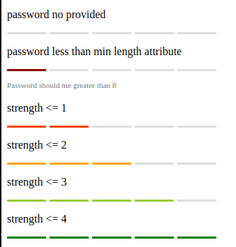

[](https://badge.fury.io/js/ngx-password-strength-meter)
[](https://codecov.io/gh/maykon-oliveira/ngx-password-strength-meter)

# Overview

The `NgxPasswordStrengthMeter` is password strength meter for [Angular](https://angular.io/) used to calculate and display the strength and/or feedback of a provided password.

To display the strength of the password with a visual feedback.



## Dependecies

- [zxcvbn](https://github.com/dropbox/zxcvbn): To estimate the strength of the password and also provide a feedback with suggestions and warning messages.

## Get Started

**Step 1:** Install ngx-password-strength-meter

```sh
npm install ngx-password-strength-meter --save
# or
yarn add ngx-password-strength-meter --save
```

**Step 2:** Import the library

```ts
import { NgxPasswordStrengthMeterModule } from 'ngx-password-strength-meter';

@NgModule({
  declarations: [AppComponent, ...],
  imports: [NgxPasswordStrengthMeterModule, ...],
  bootstrap: [AppComponent]
})
export class AppModule {
}
```

**Step 3:** Add the `ngx-password-strength-meter` element to your template

```html
<ngx-password-strength-meter [password]="password"></ngx-password-strength-meter>
```

## Changing meter colors

You can change the colors of meter by overriding the CSS variables bellow

| variable                    |                                  default                                  |
| :-------------------------- | :-----------------------------------------------------------------------: |
| --strength-meter-background |  `#dddddd` |
| --strength-meter-score-0    |  `#8b0000` |
| --strength-meter-score-1    |  `#ff4500` |
| --strength-meter-score-2    |  `#ffa500` |
| --strength-meter-score-3    |  `#9acd32` |
| --strength-meter-score-4    |  `#008000` |

```css
.strength-meter {
  --strength-meter-score-0: #668811 !important;
  --strength-meter-background: rgb(0, 38, 250) !important;
}
```

## API

- `<ngx-password-strength-meter>`

Used to calculate and display the strength of a provided password

| option           |    bind    |   type    | default | description                                                              |
| :--------------- | :--------: | :-------: | :-----: | :----------------------------------------------------------------------- |
| password         | `Input() ` |  string   |    -    | the password to calculate its strength                                   |
| enableFeedback   | `Input() ` | `boolean` | `false` | whether can display feedback                                             |
| enableLengthRule | `Input() ` | `boolean` | `true`  | whether to validate the length of the password                           |
| min              | `Input() ` | `number`  |    8    | the minimum length of the password                                       |
| max              | `Input() ` | `number`  |   30    | the maximum length of the password                                       |
| strengthChange   | `Output()` | `number`  |    -    | emits the strength of the provided password in number e.g: 0, 1, 2, 3, 4 |

- [NgxPasswordStrengthMeterService](projects/ngx-password-strength-meter/src/lib/ngx-password-strength-meter.service.ts)

Service provided that can be used to get strength of a password

```ts
export class AppComponent implements OnInit {
  constructor(private passwordStrengthMeterService: NgxPasswordStrengthMeterService) {}

  ngOnInit() {
    const result = this.passwordStrengthMeterService.calculate('123');
  }
}
```
